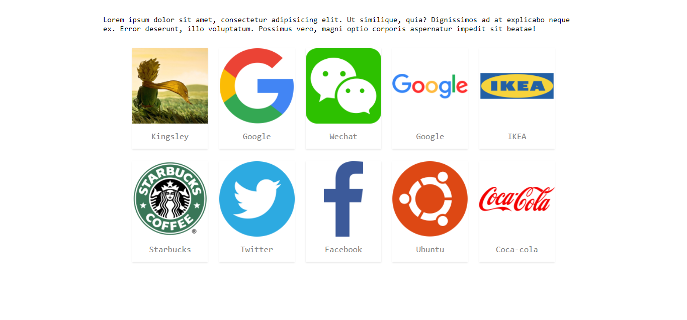

## Brief Introduction
This is a responsive link-boxes snippet inspired by and modified from Typecho's link-box, initially used for the links page of friends on my blog. Actually it can also be used as an index page or other situations which requires a list of links.

Demo is shown at [https://demos.kingsleyxie.cn/link-boxes/](https://demos.kingsleyxie.cn/link-boxes/), and here is a preview picture on PC side:



*P.S. Don't care about the icons and nicknames = =*

The [Alpha version](https://github.com/KingsleyXie/NaiveProjects/tree/c3c13f9/Snippets/link-boxes/) wrote with both CSS and JavaScript is also shown [here](https://demos.kingsleyxie.cn/link-boxes-alpha/), but it is deprecated since the CSS-only version now has a better performance.

## Usage
### With Pure HTML Code

Include the [`./link-boxes.css`](./link-boxes.css) file or add corresponding code inside it in your page code(HTML for example), and write your link boxes with syntax shown below:

```html
<div class="link-boxes">
    <a href="LINK-HERE" class="link-box">
        <div class="avatar">
            
        </div>
        <div class="nickname">NICKNAME-HERE</div>
    </a>

    <!-- or more `<a></a>` tags -->
</div>
```

Remember to change these four variables: `LINK-HERE`, `AVATAR-LINK-HERE`, `AVATAR-ALT-HERE` and `NICKNAME-HERE` to whatever value it is in your case.

### With Simplified Format
Besides the CSS file `./link-boxes.css`, add the Javascript code inside [`./link-boxes.js`](./link-boxes.js), and then you can use this kind of simplified format to create a link-box:

```html
<div class="link-boxes">
    <!-- Standard Format For Each -->
    [nickname](link~~avatar|alt)

    <!-- Or Without `alt` -->
    [nickname](link~~avatar)
</div>
```

**Note: Formated code should be inside a `div` with `link-boxes` class, otherwise they won't be parsed to the corresponding HTML code**

For example:

```html
<div class="link-boxes">
    [Google](https://www.google.com~~https://balabala.png|google)

    [Google](https://www.google.com~~https://balabala.png)
</div>
```

Moreover, you can choose not to write the AVATAR-ALT, the `alt` value will be automatically set to `avatar`.

## Customization
If you are not satisfied with the image size or other style of these link boxes, or want to customize your own link boxes, you can simply change the corresponding values inside [`./link-boxes.css`](./link-boxes.css). By default, value of the core variables are:

```css
html {
    --img-size: 150px;
}

@media (max-width: 520px) {
    html {
        --img-size: calc(50vw - 22.4px) !important;
    }
}
```

Which means if the device with is less than `520px`, image size will be `50vw - 22.4px` * `50vw - 22.4px`(22.4px is the width offset of boxes' margin). And otherwise the image size is always `150px` * `150px`
